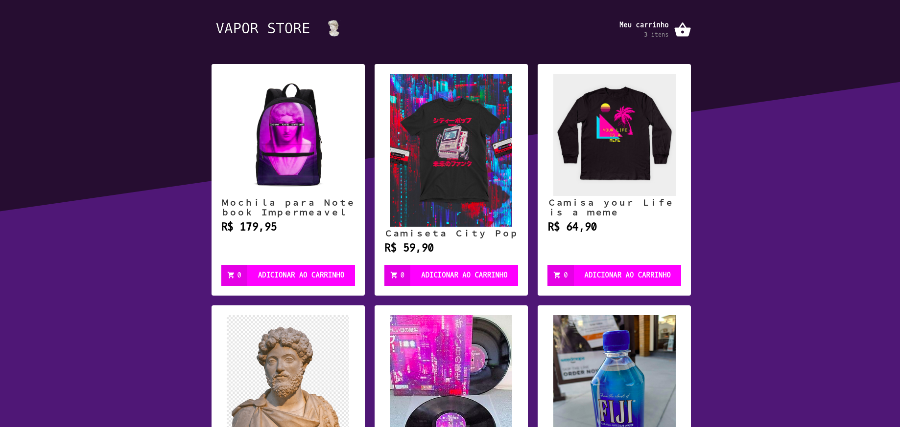
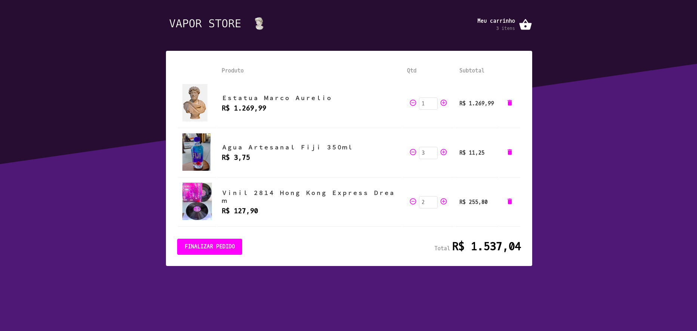

# Vapor Store

Uma página ~~fake~~ de E-Commerce feita com React JS!

## 🚀 Deploy

O projeto está hospedado na plataforma Vercel. Confira clicando no link:

<https://vapor-store.now.sh/>

## 🤔 Motivação

Criei esse projeto para praticar [Redux](https://redux.js.org/) e [Redux Saga](https://redux-saga.js.org/).

No geral, consultei as informações nas documentações e nas [vídeo-aulas da Rocketseat no yotube](https://www.youtube.com/channel/UCSfwM5u0Kce6Cce8_S72olg).

## ⚙️ API

A api consumida pelo projeto foi feita com NodeJS e o framework Express, confira o repositório clicando [aqui](https://github.com/mrocha98/vapor-store-api).

## 📜 Licença

Este projeto foi desenvolvido sob a licença [ISC](https://github.com/mrocha98/vapor-store/blob/master/license).
